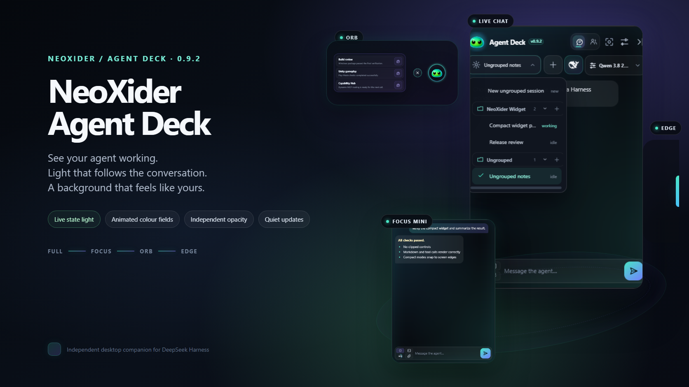
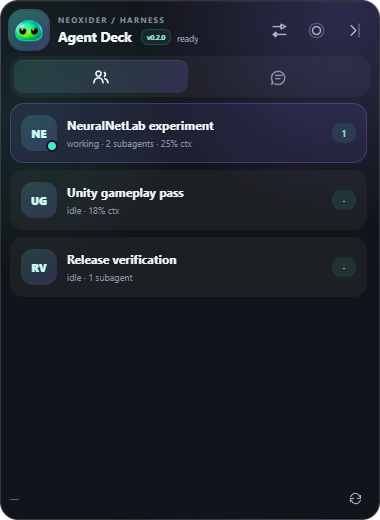
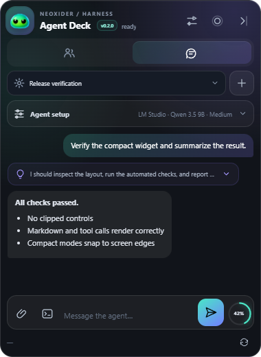
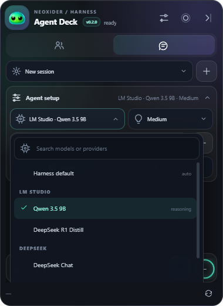
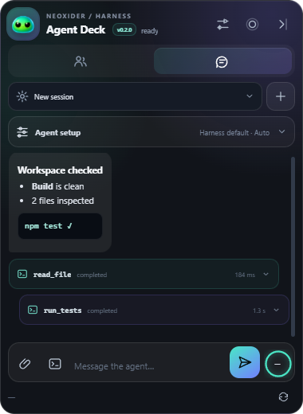
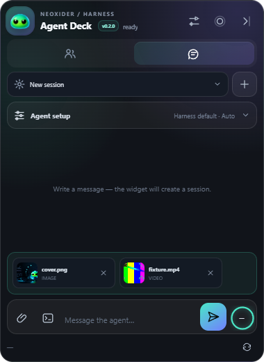
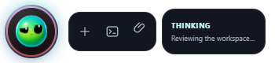

<p align="center">
  
</p>

<h1 align="center">DeepSeek Harness Widget</h1>

<p align="center"><strong>An animated Windows desktop companion for agents, context and chat.</strong></p>

<p align="center">
  <a href="https://github.com/NeoXider/deepseek-harness-widget/actions/workflows/ci.yml"></a>
  
  
  <a href="LICENSE"></a>
</p>

Agent Deck keeps [DeepSeek Harness](https://github.com/deepseek-ai/deepseek-harness) close without keeping the full web interface open. It shows live sessions and subagents, provides a real mini-chat, tracks context pressure, switches models and reasoning effort, runs native Harness commands, changes workspaces, accepts file drops, renders safe Markdown, and keeps tool calls compact.

The NeoXider avatar reacts to agent state: breathing while idle, typing while working, floating while waiting, shaking on errors and celebrating completion. A subtle inner chat glow independently distinguishes model thinking, answer generation, and tool execution; idle chat has no glow.

## Preview

<table>
  <tr>
    <td width="50%"></td>
    <td width="50%"></td>
  </tr>
  <tr>
    <td align="center"><strong>Live agent overview</strong></td>
    <td align="center"><strong>Full Harness mini-chat</strong></td>
  </tr>
  <tr>
    <td width="50%"></td>
    <td width="50%"></td>
  </tr>
  <tr>
    <td align="center"><strong>Searchable provider/model picker</strong></td>
    <td align="center"><strong>Markdown + collapsed tool calls</strong></td>
  </tr>
  <tr>
    <td colspan="2"></td>
  </tr>
  <tr>
    <td colspan="2" align="center"><strong>Stable PNG and video attachment previews</strong></td>
  </tr>
</table>

<p align="center">
  
  &nbsp;&nbsp;&nbsp;&nbsp;
  
</p>

## Highlights

- **Real Harness sessions** — session titles, running state, subagents and errors come from the live HTTP RPC API.
- **Context pressure** — a compact ring shows projected tokens against the model context window.
- **Model routing** — use the searchable dark picker for every provider/model exposed by Harness; the active/local route (including LM Studio) stays first.
- **Reasoning control** — effort options update dynamically for the selected model.
- **Native commands** — the `/` palette is loaded from `commands/list`, so `/goal`, `/plan`, `/compact`, `/permission` and plugin commands stay current.
- **Workspace switching** — select an existing Harness workspace or add a folder; the widget starts the next session there.
- **Safe Markdown** — headings, lists, tables, links, quotes and code render inside the chat; executable HTML and unsafe link protocols are blocked.
- **Collapsed tool calls** — native `tool/call`, `tool/result`, and nested Code Mode dispatches render as compact expandable rows with input, result, timing, and error state.
- **Files and drag-and-drop** — PNG, JPEG, WebP and GIF files use official image content blocks. Image and video attachments get visible previews without shifting the composer; other files become explicit local `@path` references.
- **Live chat aura** — gentle, distinct inner glows indicate thinking, writing, and tool execution. No activity means no glow.
- **Three window states** — full deck, notification avatar, or an iridescent edge handle.
- **Draggable compact modes** — drag either the avatar or the edge handle anywhere vertically or across displays; release to magnetize it to the nearest screen edge.
- **Avatar quick actions** — create a session, open Harness commands, or attach a file without restoring the full window.
- **Completion notifications** — the avatar badge increments while collapsed; the edge handle bounces when work finishes.
- **No close button** — window close gestures dock the widget to the screen edge. Quit remains available from the tray menu.
- **Personal controls** — opacity, compact/standard/large size, always-on-top and Windows autostart.

## Install

### Portable release

1. Download the latest `DeepSeek-Harness-Widget-*-portable.exe` from [Releases](https://github.com/NeoXider/deepseek-harness-widget/releases/latest).
2. Start DeepSeek Harness Web on `http://127.0.0.1:3080`.
3. Run the portable executable.

To install the latest release under `%LOCALAPPDATA%`, create a desktop shortcut and launch it:

```powershell
git clone https://github.com/NeoXider/deepseek-harness-widget.git
cd deepseek-harness-widget
powershell -ExecutionPolicy Bypass -File .\scripts\install-desktop.ps1
```

### From source

Requirements: Node.js 22+ and a running DeepSeek Harness Web profile.

```powershell
git clone https://github.com/NeoXider/deepseek-harness-widget.git
cd deepseek-harness-widget
npm ci
npm test
npm run test:ui
npm start
```

Set `DSH_WIDGET_URL` to use a different Harness endpoint.

## Controls

| Control | Action |
|---|---|
| Agents / chat tabs | Switch between the session list and mini-chat |
| Circle button | Collapse to the animated avatar and quick actions |
| Edge arrow | Dock to the iridescent edge handle |
| Terminal button | Open the live Harness command palette |
| Model chip | Search providers and models |
| Lightbulb chip | Select reasoning effort |
| Folder chip | Choose or add a workspace |
| Agent / Plan switch | Change the Harness interaction mode |
| Paperclip | Attach files or open the attachment picker |
| Stop beside Send | Cancel only the current running turn |
| Context ring beside Send | Show projected context usage |

Click the avatar or edge handle to restore the full deck. Use the tray menu to quit completely.
Drag the avatar or edge handle and release it anywhere: it snaps to the nearest left or right screen edge and remembers that side.

## How chat works

The widget does not embed or scrape the Harness web page. It uses the installed Harness RPC contracts directly:

- `session.list`, `session.history`, `session.create`, `session.prompt`, `session.cancel`
- `session.models`, `session.selectModel`
- `workspace.list`, `workspace.create`
- `commands/list`, `commands/execute`

This keeps the UI small and avoids coupling it to Harness HTML layout changes. Provider credentials remain inside Harness; the widget never reads API keys.

## Build and verify

```powershell
npm test
npm run test:ui
npm run smoke
npm run feature-smoke
npm run chat-smoke
npm run tool-smoke
npm run build
```

The portable executable is written to `release/DeepSeek-Harness-Widget-0.2.0-portable.exe`.

The test suite verifies the official Harness event shapes, safe Markdown, tool call/result correlation, compact-window geometry, and UI contracts. `test:ui` launches Electron in deterministic scenarios and rejects clipped or overflowing layouts. `feature-smoke` verifies workspace-aware session creation, live command discovery/execution and reasoning-capable model discovery. `chat-smoke` creates a real Harness session and expects an `OK` reply from the configured LM Studio route. `tool-smoke` additionally requires that model to execute a real Harness tool and checks the widget's correlated tool card.

## Security

The renderer is sandboxed with `contextIsolation` enabled and Node.js integration disabled. Local file preparation and Harness requests stay in the main process behind a narrow IPC bridge. See [SECURITY.md](SECURITY.md).

## Companion project

Reduce MCP schema overhead with one lazy tool: [DeepSeek Capability Hub](https://github.com/NeoXider/deepseek-capability-hub).

## Contributing

Focused issues and pull requests are welcome. Please include a screenshot for visual changes and a test or live smoke receipt for behavior changes.

MIT © NeoXider
