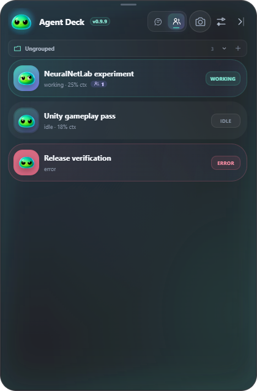
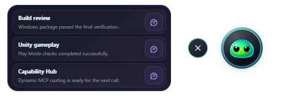
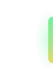

<h1 align="center">NeoXider Agent Deck</h1>
<p align="center"><strong>Your agents, within reach.</strong><br>A desktop chat, a live session board, a small companion, or just a glowing hinge.</p>
<p align="center">
  
  <a href="CHANGELOG.md"></a>
  <a href="https://github.com/NeoXider/neoxider-agent-deck/actions/workflows/ci.yml"></a>
</p>
<p align="center"><a href="https://github.com/NeoXider/neoxider-agent-deck/releases/latest"><strong>Download</strong></a> · <a href="#get-started">Get started</a> · <a href="CHANGELOG.md">What's new</a> · <a href="SECURITY.md">Security</a></p>

Agent Deck brings [DeepSeek Harness](https://github.com/deepseek-ai/deepseek-harness) onto your desktop. Follow multiple agents, continue a conversation, change models and share a screenshot without leaving your work. Collapse the chat when you need space; its state stays visible. The slim handle at the top returns the full chat to Hinge, even with the header hidden.

## Four ways to stay connected

<table>
<tr><td width="50%" align="center"><strong>Chat</strong><br>Messages, tools, attachments and model controls.<br></td><td width="50%" align="center"><strong>Sessions</strong><br>See who's working and jump into any session.<br></td></tr>
<tr><td align="center"><strong>Avatar</strong><br>A small companion with recent sessions.<br></td><td align="center"><strong>Hinge</strong><br>A discreet status handle at the screen edge.<br></td></tr>
</table>

These are screenshots of the current UI using demonstration sessions. Avatar and Hinge are called Orb and Edge in some internal settings and diagnostics.

## Small window. Full conversation.

- **One model control.** Model and reasoning effort share a chip. Open its slider, click the model name to choose another model, or reset effort to Auto. The two highest supported levels have distinct themed animations.
- **Readable activity.** Streaming Markdown, grouped tools, queued messages, a compact goal strip and context usage. Background jobs have a separate waiting state.
- **Your space, your look.** Aurora, Graphite, Midnight, Cyberpunk and Cave; preview cards, custom images, saved design profiles and independent image opacity. Theme and background stay linked until you enable the override.
- **Less interruption.** Remembered window positions, compact drag handles, round controls and reduced-motion support. Focus mode keeps just the conversation.
- **Screenshots in one shortcut.** Capture for review, or send the current screen directly to the selected chat. Deck hides during its own capture.

## Get started

1. Download the installer or `NeoXider-Agent-Deck-0.9.9-windows-x64-portable.exe` from [Releases](https://github.com/NeoXider/neoxider-agent-deck/releases/latest).
2. Start Harness Web at `http://127.0.0.1:3080`, or use **Start** in Deck's offline banner.
3. If authentication is required, use **Connect** and paste the `dsh web:` launch URL once. Choose a session and start chatting.

Updates are downloaded and verified through **Settings → Updates**. Windows is the primary target; macOS and Linux packages are experimental. Current desktop builds are unsigned, so SmartScreen or Gatekeeper may ask for confirmation.

### Window layers and private capture

| Layer | Behaviour |
|---|---|
| Desktop | Desktop layer: every ordinary window covers the widget, including compact modes. |
| Above | Stays above ordinary app windows. |
| **Always on top+** | Reasserts its position above ordinary and borderless windows. |
| **Private overlay** | Windows only: stays above apps and requests exclusion from supported screenshots and screen sharing. |

Private overlay uses Windows capture exclusion through [Electron content protection](https://www.electronjs.org/docs/latest/api/browser-window#winsetcontentprotectionenable). On Windows 10 version 2004 and newer, supported capture methods omit the window; older versions may show a black area. Some recording methods can ignore the request. It is not a guarantee against every capture tool, nor does any desktop layer guarantee visibility over exclusive fullscreen games. A native [Xbox Game Bar companion](windows-gamebar/README.md) is available separately.

### Shortcuts

All shortcuts can be changed or disabled in **Settings → Shortcuts**.

| Default shortcut | Action |
|---|---|
| Ctrl+Alt+Shift+Space | Show or restore Deck |
| Ctrl+Alt+Shift+F | Toggle Focus chat |
| Ctrl+Alt+Shift+A / E | Collapse to Avatar / Hinge |
| Ctrl+Alt+Shift+N | New session |
| Ctrl+Alt+Shift+H | Open the current session in Harness |
| Ctrl+Alt+Shift+D / S | Capture display / region for review |
| **Ctrl+Alt+Shift+Enter** | **Capture the monitor under the pointer and send it immediately** |

Immediate capture preserves your draft and foreground focus. The snapshot goes to the session selected when the shortcut was pressed. On macOS, use Command in place of Ctrl for supported shortcuts.

### Open Harness from your phone

Enable **Device access on Wi-Fi** in the tray menu. Open the Phone address on the same trusted network, request access, compare the code and approve the browser on your computer. Deck keeps Harness authentication inside its local proxy; you do not need to copy a launch token to the phone.

## Run from source

Requires Node.js 22+ and a Harness Web profile.

```powershell
git clone https://github.com/NeoXider/neoxider-agent-deck.git
cd neoxider-agent-deck
npm ci
npm start
```

Set `DSH_WIDGET_URL` for a different Harness endpoint. Source version 0.9.9 includes unified effort controls, themed motion and the Windows private overlay.

## Verify and build

```powershell
npm test
npm run test:input
npm run test:ui
npm run test:reasoning
npm run test:performance
npm audit --audit-level=high
npm run build
```

The tests cover session contracts, streaming, attachments, window geometry and compact layouts. Release CI builds Windows, Intel/Apple Silicon macOS, Linux and the Game Bar companion, then publishes checksums with the artifacts. The Windows portable output is `release/NeoXider-Agent-Deck-0.9.9-windows-x64-portable.exe`.

## Trust and integration

Deck uses Harness RPC directly. It does not scrape the web UI or read provider API keys. The renderer is sandboxed; file preparation and requests pass through a narrow IPC bridge.

Sessions created or prompted through Deck are set to Harness **danger-full-access**. Agents may read, write, run commands and use configured tools without another permission prompt. Use trusted models, workspaces and MCP servers. See [SECURITY.md](SECURITY.md).

- [NeoXider MCP Hub](https://github.com/NeoXider/neoxider-mcp-hub) — load tools on demand.
- [DSH background code integration](integrations/dsh-background-code/README.md) — return long-running scripts as background jobs and deliver their completion to the agent.
- [Architecture](ARCHITECTURE.md) · [Changelog](CHANGELOG.md) · [Roadmap](TODO.md)

MIT © NeoXider
