<p align="center">
  
</p>

<h1 align="center">NeoXider Agent Deck</h1>

<p align="center"><strong>Your agents, alive on the desktop — a glowing companion for DeepSeek Harness sessions, context and chat.</strong></p>

<p align="center">
  <a href="https://github.com/NeoXider/neoxider-agent-deck/actions/workflows/ci.yml"></a>
  
  
  
  <a href="CHANGELOG.md"></a>
  <a href="LICENSE"></a>
</p>

Agent Deck keeps [DeepSeek Harness](https://github.com/deepseek-ai/deepseek-harness) close without keeping the full web interface open. It shows live sessions and subagents, provides a real mini-chat, tracks context pressure, switches models and reasoning effort, runs native Harness commands, changes workspaces, accepts file drops, renders safe Markdown, and keeps tool calls compact.

The NeoXider avatar reacts to agent state: breathing while idle, typing while working, floating while waiting, shaking on errors and celebrating completion. A subtle inner chat glow independently distinguishes model thinking, answer generation, and tool execution; idle chat has no glow. Short spring transitions make buttons, Send, view changes, avatar collapse, and edge docking feel responsive without ignoring Windows reduced-motion preferences.

## Preview

<table>
  <tr>
    <td width="50%"></td>
    <td width="50%"></td>
  </tr>
  <tr>
    <td align="center"><strong>Live agent overview</strong></td>
    <td align="center"><strong>Full Harness mini-chat</strong></td>
  </tr>
  <tr>
    <td width="50%"></td>
    <td width="50%"></td>
  </tr>
  <tr>
    <td align="center"><strong>Searchable provider/model picker</strong></td>
    <td align="center"><strong>Markdown + collapsed tool calls</strong></td>
  </tr>
  <tr>
    <td colspan="2"></td>
  </tr>
  <tr>
    <td colspan="2" align="center"><strong>Stable PNG and video attachment previews</strong></td>
  </tr>
  <tr>
    <td width="50%">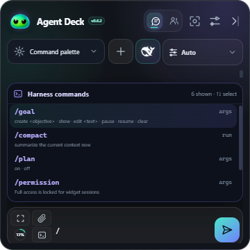</td>
    <td width="50%">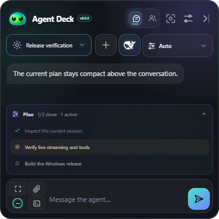</td>
  </tr>
  <tr>
    <td align="center"><strong>Compact native command palette</strong></td>
    <td align="center"><strong>Live Harness TODO plan</strong></td>
  </tr>
  <tr>
    <td width="50%">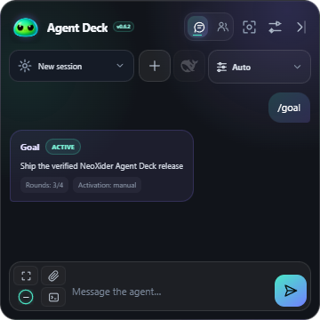</td>
    <td width="50%">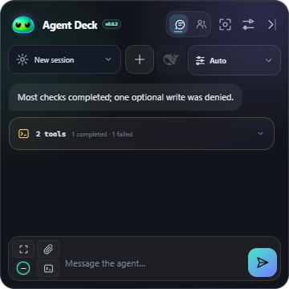</td>
  </tr>
  <tr>
    <td align="center"><strong>Readable structured command results</strong></td>
    <td align="center"><strong>Per-tool status, even in mixed groups</strong></td>
  </tr>
  <tr>
    <td width="50%">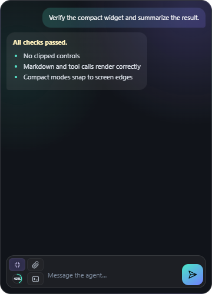</td>
    <td width="50%">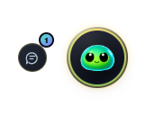</td>
  </tr>
  <tr>
    <td align="center"><strong>One-click Focus Chat</strong></td>
    <td align="center"><strong>Session-aware compact notification</strong></td>
  </tr>
  <tr>
    <td width="50%">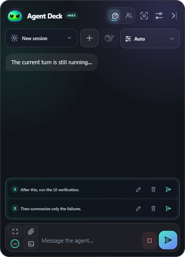</td>
    <td width="50%">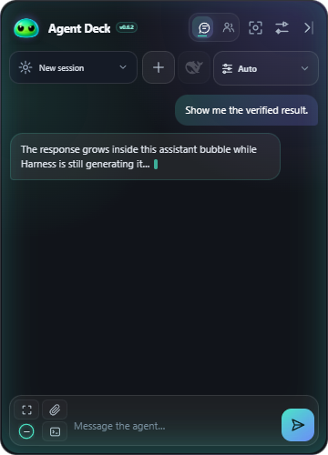</td>
  </tr>
  <tr>
    <td align="center"><strong>Edit, delete or send queued messages now</strong></td>
    <td align="center"><strong>Streaming answer grows in place</strong></td>
  </tr>
  <tr>
    <td width="50%">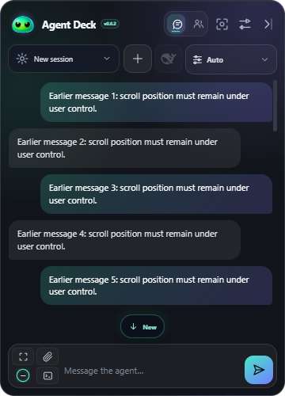</td>
    <td width="50%">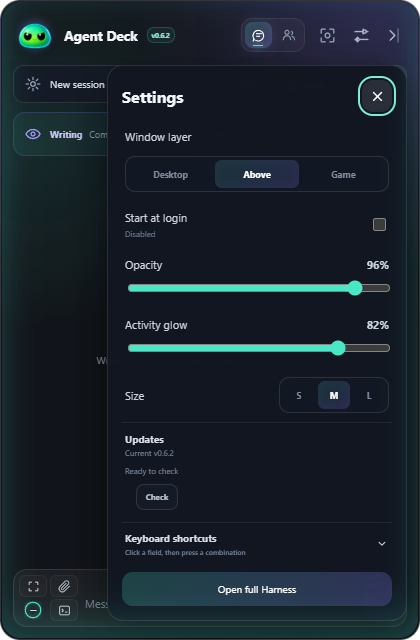</td>
  </tr>
  <tr>
    <td align="center"><strong>Reading position stays under user control</strong></td>
    <td align="center"><strong>Three window layers + adjustable glow</strong></td>
  </tr>
  <tr>
    <td width="50%">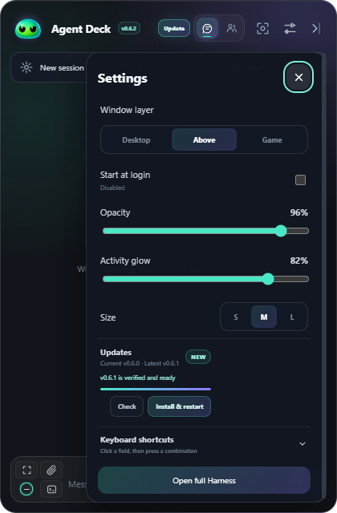</td>
    <td width="50%">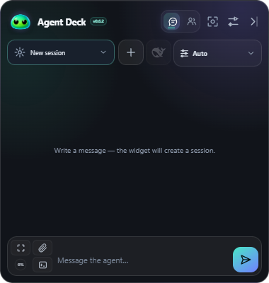</td>
  </tr>
  <tr>
    <td align="center"><strong>Verified update, one-click restart</strong></td>
    <td align="center"><strong>Complete UI before the first session</strong></td>
  </tr>
  <tr>
    <td width="50%">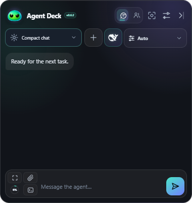</td>
    <td width="50%">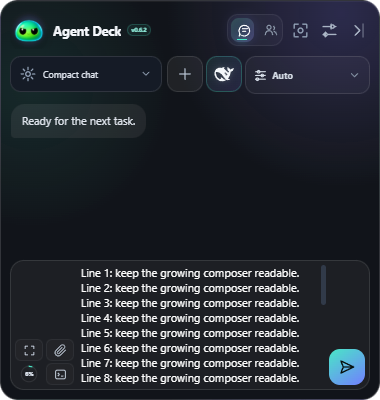</td>
  </tr>
  <tr>
    <td align="center"><strong>Compact by default</strong></td>
    <td align="center"><strong>Grows to one third, then scrolls</strong></td>
  </tr>
</table>

<p align="center">
  
  &nbsp;&nbsp;&nbsp;&nbsp;
  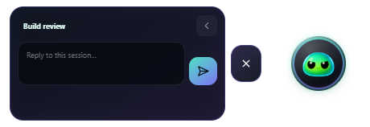
  &nbsp;&nbsp;&nbsp;&nbsp;
  
</p>

## Highlights

- **Chat-first navigation** — the real mini-chat is the default first page; the agent deck is one tap away.
- **State-aware agent deck** — every session card changes its avatar, glow and label for working, idle or error state. Activity is cleared from authoritative turn events, so a completed or failed session does not remain falsely marked as working.
- **Real Harness sessions** — session titles, running state, subagents and errors come from the live HTTP RPC API.
- **Context pressure** — a compact ring shows projected tokens against the model context window and remains a calm `0%` ring before the first session exists.
- **Model routing** — use the searchable dark picker for every provider/model exposed by Harness; the active/local route (including LM Studio) stays first.
- **Reasoning control** — effort options update dynamically for the selected model.
- **Native commands** — the vertical `/` palette opens above the composer and is loaded from `commands/list`, so `/goal`, `/plan`, `/compact`, `/permission` and plugin commands stay current without covering the input.
- **Workspace switching** — select an existing Harness workspace or add a folder; the widget starts the next session there.
- **Safe, colorful Markdown** — headings, emphasis, links, quotes, tables, inline code and fenced code use a restrained dark palette, with Highlight.js syntax colors for supported languages; executable HTML and unsafe link protocols are blocked.
- **Collapsed tool runs** — consecutive native `tool/call`, `tool/result`, and nested Code Mode dispatches become one expandable group; each child still exposes input, result, timing, and error state.
- **Live answer bubble** — streamed assistant text grows inside the real chat bubble as it arrives; the activity card remains reserved for reasoning and tool state instead of mislabeling an answer as thinking.
- **Ephemeral reasoning** — live reasoning stays in one collapsed activity card while the model is generating, then disappears when the turn is complete instead of cluttering chat history.
- **Authoritative Harness queue** — messages sent during a running turn appear as compact one-line queued items from Harness itself, with Edit, Delete and Send now actions.
- **Respectful scrolling** — reading older messages is never interrupted by forced auto-scroll; a compact jump-to-latest control appears when new content arrives below.
- **Files and drag-and-drop** — PNG, JPEG, WebP and GIF files use official image content blocks. Image and video attachments get visible previews without shifting the composer; other files become explicit local `@path` references.
- **Instant screenshots** — capture a selected region or the current display from the header or a global shortcut, inspect the PNG preview above the composer, then decide whether to send it.
- **Rebindable global shortcuts** — show/collapse the deck, create a session, capture a region or display, focus chat, and open Harness; every binding can be disabled, changed, reset, and survives restart.
- **Live chat aura** — brighter-by-default, distinct inner glows indicate thinking, writing, and tool execution. No activity means no glow, and glow intensity is adjustable in settings.
- **Focus Chat** — one compact composer button hides all chrome and setup surfaces, leaving only messages, optional attachment previews, the input, context and actions; tap it again to restore everything.
- **Three window states** — full deck, notification avatar, or an iridescent edge handle.
- **Draggable compact modes** — where the desktop compositor permits window positioning, drag either the avatar or the edge handle across displays and release to magnetize it to the nearest screen edge.
- **Persistent per-mode placement** — full, avatar and edge modes remember their own monitor, side and vertical position across restarts; missing displays are handled by safely clamping the window into the current work area.
- **Click-through edge glow** — on supported native desktops, only the visible 8 px edge line (plus a small comfort margin) accepts hover, restore, and drag input; the wider transparent glow does not block clicks in apps underneath. Linux X11 exposes an honestly labeled wider interactive edge, while Wayland disables Edge mode.
- **Smooth pet status glow** — the collapsed avatar now eases between idle, thinking, writing, tool, waiting, error, and done palettes instead of switching its ring abruptly.
- **Classic NeoXider slimes** — idle, working, waiting, error, and done now use the original soft-bottom mascot shapes from NeoXider Video Studio instead of the round variants.
- **Click-or-drag brand** — click the full-size avatar to collapse, click the NeoXider title to open the repository, or drag anywhere across the brand area to move the full widget. Brand text is non-selectable, so a drag cannot turn into a text selection.
- **Exact-session pet reply** — collapsed pet mode keeps one useful reply button instead of create/command/attachment clutter; it opens the agent and session that produced the reply.
- **Session-aware notifications** — a completed reply slides out for about 2.7 seconds with its session name and answer preview; clicking it restores that exact session. The edge handle still bounces when work finishes.
- **Three window layers** — choose Normal, the default Above layer, or the strongest available Game layer. Game is best-effort: exclusive fullscreen and anti-cheat overlays can still win, and unsupported Linux desktops disable the choice instead of silently pretending it worked.
- **No close button** — window close gestures dock the widget to the screen edge. Quit remains available from the tray menu.
- **Single-instance launch** — repeated shortcut clicks focus the existing widget instead of stacking translucent windows.
- **Personal controls** — opacity, compact/standard/large size, chat glow intensity, window layer and Start at login where the platform supports them.
- **Locked-down renderer** — a strict Content Security Policy (`default-src 'none'`, no `unsafe-inline`, no `unsafe-eval`), denied window creation, blocked navigation and protocol-checked external links mean model output can render but never execute or navigate.
- **Survives a renderer crash** — a frameless transparent window that loses its renderer is reloaded automatically instead of lingering as a dead shape that only the task manager can remove.
- **Keyboard and screen reader support** — every reachable control draws a visible focus ring, dimmed labels hold WCAG AA contrast, and the conversation is exposed as an ARIA log region.
- **Reliable portable autostart** — Start at login on Windows targets the stable portable launcher instead of Electron's temporary extracted child; existing stale startup entries are migrated automatically.
- **Quiet background updates** — supported builds check and download a stable release without interrupting the chat. Only after the file is fully verified does a compact **Update** action appear beside the version; installation and restart still require one click.
- **Xbox Game Bar bridge** — the Windows package includes a bounded native sidecar for the separate Game Bar companion. The protocol authenticates the exact AppContainer package, exposes only snapshot, acknowledge, exact-session open and quick reply, and never injects into a game process.

## Install

### Portable release

1. Download the latest `NeoXider-Agent-Deck-*-windows-x64-portable.exe` from [Releases](https://github.com/NeoXider/neoxider-agent-deck/releases/latest).
2. Start DeepSeek Harness Web on `http://127.0.0.1:3080`, or press **Start** in the offline banner. The widget prefers an installed official runtime and avoids spawning a duplicate while a previous launch is still starting.
3. Run the portable executable.

To install the latest release under `%LOCALAPPDATA%`, create a desktop shortcut and launch it:

> **One-time upgrade note:** 0.5.0 is the first release with in-app updating. Version 0.4.3 and earlier cannot update themselves, so install 0.5.0 manually once; later supported releases can use **Settings → Updates**.

```powershell
git clone https://github.com/NeoXider/neoxider-agent-deck.git
cd neoxider-agent-deck
powershell -ExecutionPolicy Bypass -File .\scripts\install-desktop.ps1
```

### From source

Requirements: Node.js 22+ and a running DeepSeek Harness Web profile.

```powershell
git clone https://github.com/NeoXider/neoxider-agent-deck.git
cd neoxider-agent-deck
npm ci
npm test
npm run test:ui
npm start
```

Set `DSH_WIDGET_URL` to use a different Harness endpoint.

## Controls

| Control | Action |
|---|---|
| Glowing header tabs | Switch between the session list and mini-chat |
| Focus icon in the composer | Hide every surface except chat, attachment previews, input, context and actions; tap again to restore |
| Full-size avatar | Click to collapse to the animated avatar and quick actions; drag to move the window |
| NeoXider / Agent Deck title | Click to open this repository; drag to move the window |
| DeepSeek whale beside the session | Open the selected session directly in Harness Web |
| Edge arrow | Dock to the iridescent edge handle |
| Terminal button | Open the live Harness command palette |
| Model chip | Search providers and models |
| Lightbulb chip | Select reasoning effort |
| Folder chip | Choose or add a workspace |
| Agent / Plan switch | Change the Harness interaction mode |
| Paperclip | Attach files or open the attachment picker |
| Chat icon beside the collapsed pet | Show the latest reply; click the preview to open that exact session |
| Jump-to-latest button | Return to the newest message after reading older chat content |
| Stop beside Send | Cancel only the current running turn |
| Context ring at the far left | Show projected context usage |
| Send at the far right | Submit the current message or attachments |

Click the collapsed avatar or edge handle to restore the full deck. Use the tray menu to quit completely.
Drag a collapsed avatar or edge handle and release it anywhere: it snaps to the nearest left or right screen edge and remembers that side.

## How chat works

The widget does not embed or scrape the Harness web page. It uses the installed Harness RPC contracts directly:

- `session.list`, `session.history`, `session.create`, `session.prompt`, `session.cancel`
- `session.updateQueue` for authoritative Edit, Delete and Send now queue actions
- `session.models`, `session.selectModel`
- `workspace.list`, `workspace.create`
- `commands/list`, `commands/execute`

This keeps the UI small and avoids coupling it to Harness HTML layout changes. Provider credentials remain inside Harness; the widget never reads API keys.

Every session created or prompted from the widget is explicitly switched to Harness `danger-full-access` before the prompt runs. This matches the widget's intended trusted-desktop workflow, but it also means the selected agent can read, write, execute, and use configured tools without an additional permission prompt. Use the widget only with models, workspaces, MCP servers, and skills you trust.

## Build and verify

```powershell
npm test
npm run test:platforms
npm run test:input
npm run test:ui
npm audit --audit-level=high
npm run smoke
npm run feature-smoke
npm run chat-smoke
npm run tool-smoke
npm run build
```

The portable executable is written to `release/NeoXider-Agent-Deck-0.6.2-windows-x64-portable.exe`.

The test suite verifies the official Harness event shapes, ephemeral reasoning, safe Markdown, tool grouping/correlation, single-instance behavior hooks, compact-window geometry, and UI contracts. `test:ui` launches Electron in deterministic desktop and minimum-size scenarios and rejects clipped or overflowing layouts. `feature-smoke` verifies workspace-aware session creation, live command discovery/execution and reasoning-capable model discovery. `chat-smoke` creates a real Harness session and expects an `OK` reply from the configured LM Studio route. `tool-smoke` additionally requires that model to execute a real Harness tool and checks the widget's correlated tool card.

The 0.6.2 acceptance run also used the exact local `lmstudio/qwen3.8-27b-unleashed` route. One Harness session produced 1,626 streamed reasoning deltas, 221 streamed answer deltas, a TODO projection, three successful tools, highlighted Markdown, and a clean `turn/end`; the widget transform preserved the Russian answer and semantic token. A separate read-only run exercised Dynamic MCP search → inspect → enable → tools → call → skill.load → disable with zero tool errors. Durable receipts: [widget parity](docs/verification/qwen3.8-27b-widget-parity.json) and [Dynamic MCP](docs/verification/qwen3.8-27b-dynamic-mcp.json).

## Security

The renderer is sandboxed with `contextIsolation` enabled and Node.js integration disabled. Local file preparation and Harness requests stay in the main process behind a narrow IPC bridge. Release downloads are bounded and digest-verified before replacement. Current Windows and macOS artifacts are not code-signed, so SmartScreen/Gatekeeper can warn until a signing certificate is configured. See [SECURITY.md](SECURITY.md).

## Companion project

Reduce MCP schema overhead with one lazy tool: [NeoXider MCP Hub](https://github.com/NeoXider/neoxider-mcp-hub).

## Roadmap

Screen capture, configurable global hotkeys, and the three-session pet switcher ship in 0.5.0. Remaining overlay diagnostics, clipboard capture, per-game profiles, and quiet-notification work is tracked in [TODO.md](TODO.md).

## Changelog

Every release is documented in [CHANGELOG.md](CHANGELOG.md). The current release, 0.6.2,
adds the chat-first 360 px interface, native commands and TODOs, streamed reasoning and answers,
an editable no-duplicate queue, mixed-result tool cards, three-session Orb replies, persistent
window/settings state, capture and hotkeys, quiet staged updates, and verified Qwen 3.8 27B
plus Dynamic MCP parity.

## Platform support

Windows 10 and 11 are the primary supported target. CI also packages Intel/Apple Silicon
macOS builds and Linux AppImage/deb builds, but those remain **experimental**. Linux uses
a freedesktop autostart entry; it disables native opacity and Game layer controls;
Wayland also disables window dragging and Edge mode, while X11 labels its wider interactive
Edge area. When no installed Harness runtime is found, `Start Harness` relies on `npx` being
present in the launcher environment, which is not guaranteed for an app started from Finder
or a desktop launcher. The Electron Game layer works over ordinary and borderless windows;
true exclusive fullscreen can outrank desktop windows, so the repository keeps the native
Xbox Game Bar companion path explicit rather than claiming a guarantee the OS does not give.

## Contributing

Focused issues and pull requests are welcome. Please include a screenshot for visual changes and a test or live smoke receipt for behavior changes.

MIT © NeoXider
